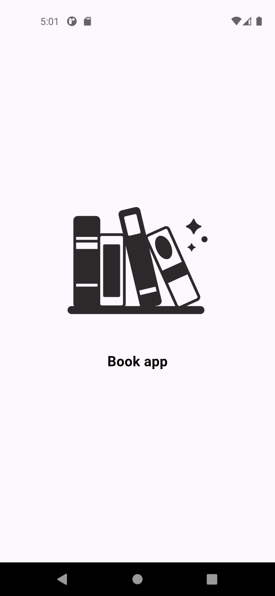
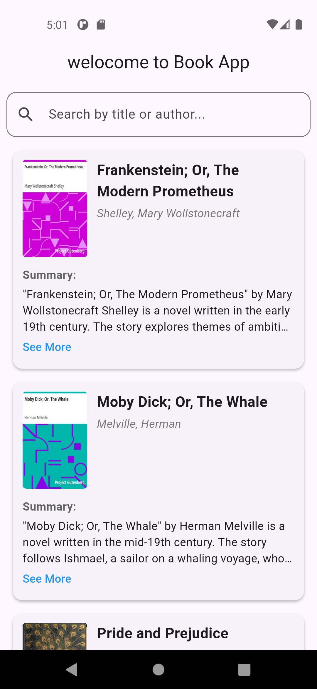

# Book App

A simple Flutter application to manage and display books.

  


## Getting Started

This project is a starting point for a Flutter application.

### Prerequisites

Ensure you have Flutter installed on your machine. You can follow the installation instructions from the official Flutter website:
[Flutter Installation Guide](https://flutter.dev/docs/get-started/install)

### Installation

Clone the repository:
```bash
git clone https://github.com/ahmedomar201/book_app.git
cd book_app
```

Install dependencies:
```bash
flutter pub get
```

### Running the App

To run the application:
```bash
flutter run
```

## Project Structure

- `lib/`: Contains the Flutter app code.
- `test/`: Contains unit and widget tests.

## License

This project is licensed under the MIT License - see the [LICENSE](LICENSE) file for details.
